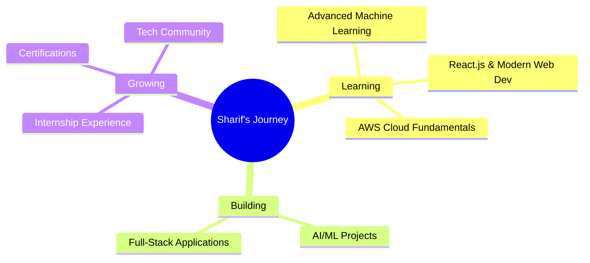

<div align="center">

<!-- Animated Header -->


</div>

<div align="center">

[](https://www.linkedin.com/in/nagur-sharif-shaik-23b8b3315)
[](mailto:shaiknagursharif19@gmail.com)
[](https://www.hackerrank.com/profile/Sk_Nagur_Sharif)
[](https://x.com/___Sharif__09)


</div>

---

## 🎯 About Me

```typescript
const sharif = {
    location: "Chennupalli, Andhra Pradesh, India 🇮🇳",
    education: "MCA - Final Year @ Aditya University, Surampalem",
    role: "MCA Fresher | Java & Python Developer | AI/ML Enthusiast",
    currentFocus: [
        "Advanced Machine Learning & Deep Learning",
        "React.js & Modern Web Development",
        "Cloud Fundamentals (AWS)"
    ],
    passion: ["Machine Learning", "Web Development", "Open Source"],
    superpower: "Quick Learner + Consistent Effort",
    motto: "Learn continuously, build efficiently, grow steadily 🚀",
    lookingFor: [
        "Entry-Level Java Engineer Roles",
        "AI / Machine Learning Engineer Roles",
        "Entry-Level Software Development Roles",
        "Internships & Collaborations",
        "Open Source Contributions"
    ]
};
```

### 🚀 What Drives Me

- 🤖 **AI/ML Enthusiast** - Built adaptive learning systems and trained ML models hands-on
- 💻 **Full-Stack Curious** - Comfortable across Java backend and React front-end
- 📚 **Fast Learner** - 15+ certifications and 5 internships completed as a fresher
- 🧩 **Problem Solver** - Verified coding skills on HackerRank (Java 2★, SQL 3★)
- 🎯 **Detail-Oriented** - Committed to writing clean, scalable, maintainable code
- 🌱 **Always Growing** - Actively exploring AWS, advanced ML, and modern web stacks

---

## 🎓 Education

| Degree | Institution | Duration | Score |
|---|---|---|---|
| Master of Computer Applications (MCA) | Aditya University, Surampalem | Aug 2024 – Apr 2026 | 82.30% |
| Bachelor of Science (Computer Science) | DRNSCVS Degree College, Chilakaluripet | Aug 2021 – Apr 2024 | 87.20% |
| Intermediate (MPC) | Board of Intermediate Education, Ballikurava | Jun 2019 – Mar 2021 | 83.6% |
| SSC | Board of Secondary Education, Ballikurava | Jun 2018 – Mar 2019 | 87% |

> 🏅 **Aditya University accreditations:** NIRF Rank Band 151–200 • NAAC A++ Grade • NBA Tier 1 Accredited • Times Higher Education Impact Rank • i-Gauge Diamond Rated

---

## 💼 Internship Experience

- **Customer Support Executive** — Alldigi Tech Ltd *(Upcoming, Aug 2026 – Oct 2026)*
- **Front-End Development Intern** — Squarcell Resource India Pvt Ltd (QSkill) *(Remote, Jun 1 – Jul 1, 2026)*
- **ML Intern** — ConvalentX Technologies Pvt Ltd *(Remote, May 20 – Jun 20, 2026)*
- **AI Intern** — Skilldezire Technology Pvt Ltd *(Remote, May 2025 – Jun 2025)*
- **Java Intern** — Cognifyz Technology Pvt Ltd *(Remote, Feb 2025 – Mar 2025)*

---

## 🏆 Achievements & Recognition

<table>
<tr>
<td width="50%">

### 🥇 Recognition & Ratings
- 🥉 **2★ Java (Programming)** — HackerRank
- 🥈 **3★ SQL** — HackerRank
- 🎓 **Placement Certificate** — Alldigi Tech Ltd, recognized at Aditya University Achievers Day 2026

</td>
<td width="50%">

### 📜 Certifications
- ✅ NPTEL Elite — Joy of Computing using Python
- ✅ SkillDzire — AI Internship Completion
- ✅ Cognifyz — Java Development Internship
- ✅ Infosys Springboard — Introduction to Python
- ✅ Power BI Micro Course — Skill Course
- ✅ Microsoft Learn — Generative AI & M365 (6 certs)

</td>
</tr>
<tr>
<td colspan="2">

### 🎉 Extra-Curriculars
- 🏆 TRiQ "Think Twice" Quiz Battle — OutThinkX
- 🏆 TATA Crucible Campus Quiz 2025 — Unstop / Tata Group
- 🏆 Google Gemini QuizOff 2026 — CampusCrew (Unstop)
- 🎖️ AI Basics Webinar — evo11ve
- 🌟 100K Milestone Community Honor — CampusCrew

</td>
</tr>
</table>

---

## 🚀 Featured Projects

<div align="center">

| Project | Description | Tech Stack | Repo / Demo |
|---|---|---|---|
| 🤖 **AI-Based Adaptive Learning & Skill Recommendation System** | Adaptive learning engine that tracks student performance and recommends personalized content | Python, Machine Learning | [View Repo](https://github.com/Shaik-Nagur-Sharif-09/AI-Based-Adaptive-Learaning-Skill-Recommendation-System) |
| 🧰 **Lingo — All-in-One Developer Tools Platform** | Unified platform with Translator, String Generator, QR Generator, Password Checker & Notes | React, Tailwind CSS, React Router | [View Repo](https://github.com/Shaik-Nagur-Sharif-09/LingoTools) |

</div>

---

## 🛠️ Tech Arsenal

<div align="center">

### Languages


### Frontend Development


### Databases


### Data Science / AI


### Tools & Platforms


</div>

---

## 📊 GitHub Analytics

<div align="center">


</div>

---

## 🏆 GitHub Trophies

<div align="center">

[](https://github.com/ryo-ma/github-profile-trophy)

</div>

---

## 🎯 Current Focus



---

## 💭 Dev Quote

<div align="center">


</div>

---

## 🤝 Let's Connect & Collaborate!

<div align="center">

I'm always excited to connect with fellow developers, learn from feedback, and take on new opportunities!

### 💼 Open For
- ☕ Java Engineer / Java Developer roles
- 🤖 AI / Machine Learning Engineer roles
- 💻 Entry-level Software Development roles
- 🌐 Open-source contributions
- 📚 Learning & knowledge sharing

[](https://www.linkedin.com/in/nagur-sharif-shaik-23b8b3315)
[](mailto:shaiknagursharif19@gmail.com)
[](https://www.hackerrank.com/profile/Sk_Nagur_Sharif)
[](https://x.com/___Sharif__09)

</div>

---

<div align="center">

### 🌟 "Learn continuously, build efficiently, grow steadily" ✨

**Thanks for visiting! Let's build something amazing together 🚀**


</div>

<div align="center">

**Made with ❤️ by Shaik Nagur Sharif**


*Last Updated: July 2026*

</div>
